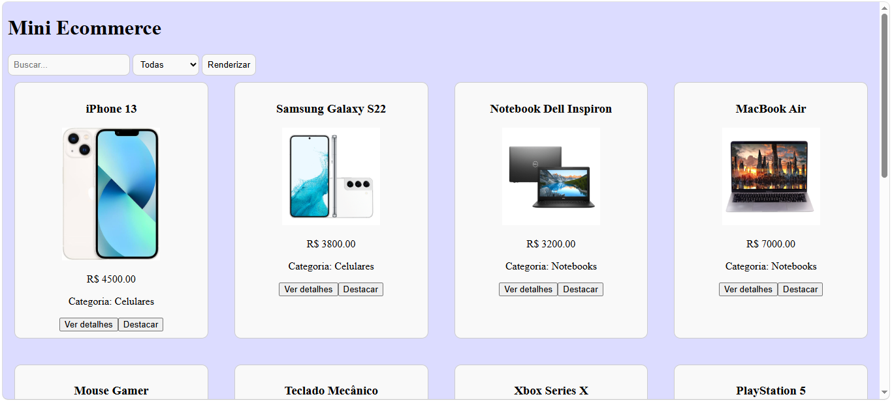
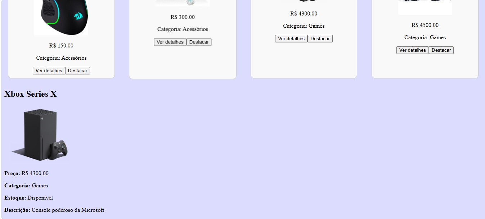
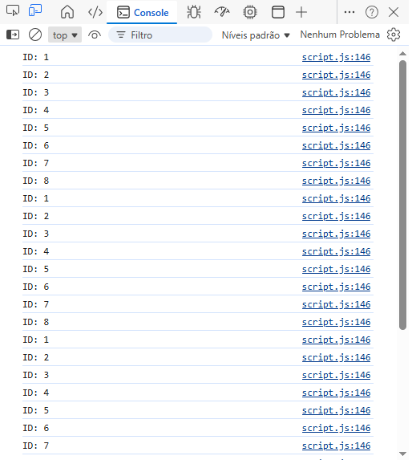

# Trabalho Prático - Semana 9

Nesta atividade, você vai montar um programa para praticar funções em JavaScript e a manipulação do DOM, criando uma tela simples no estilo eCommerce que lista produtos em cards a partir de um objeto JSON (array de produtos).

## Informações Gerais

- Nome: Letícia Xavier Abreu
- Matricula: 910742

## Print dos cards renderizados

<<  COLOQUE A IMAGEM AQUI >>

## Print da área de detalhes preenchida após clicar em “Ver detalhes”

<<  COLOQUE A IMAGEM AQUI >>

## Print do console

<<  COLOQUE A IMAGEM AQUI >>